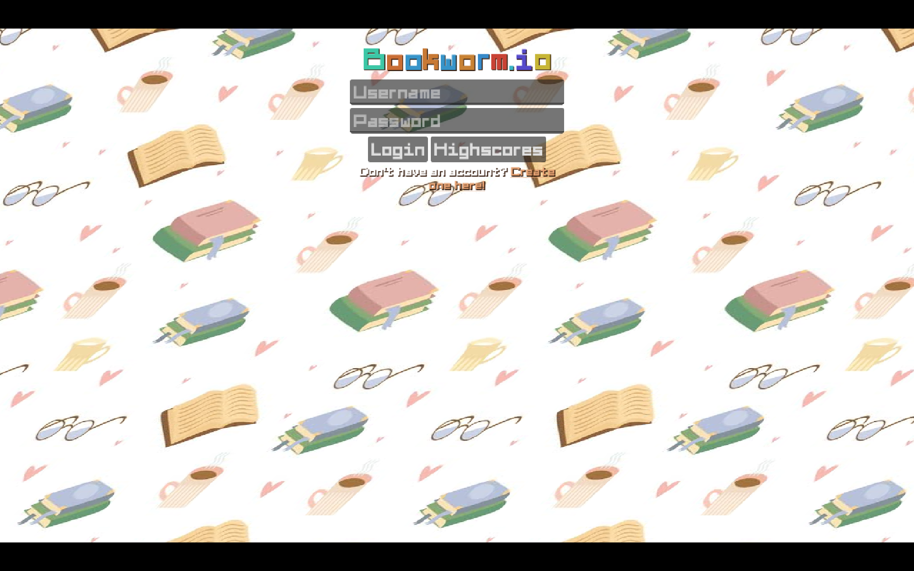
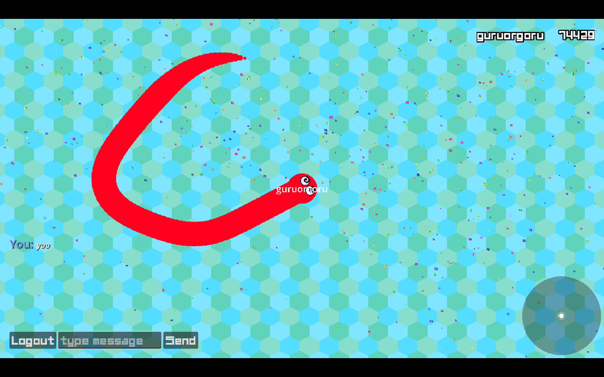
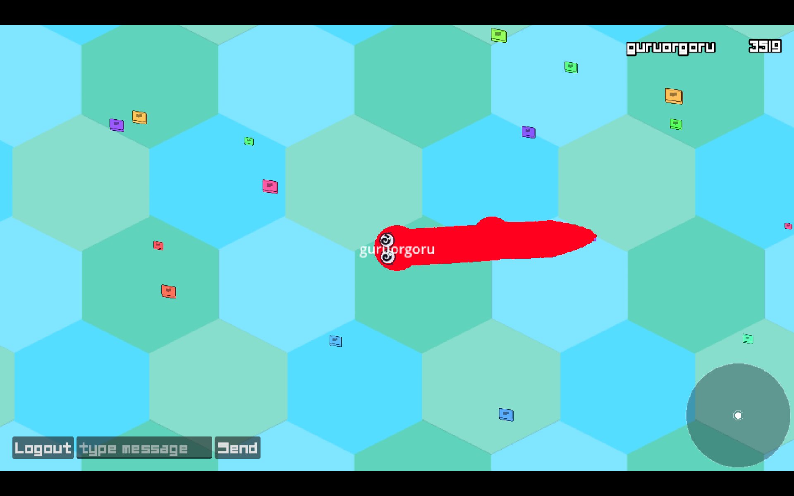
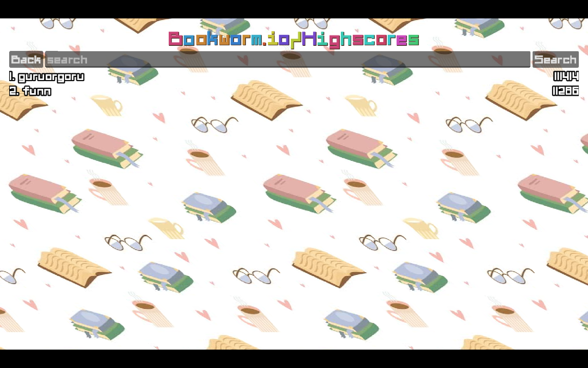
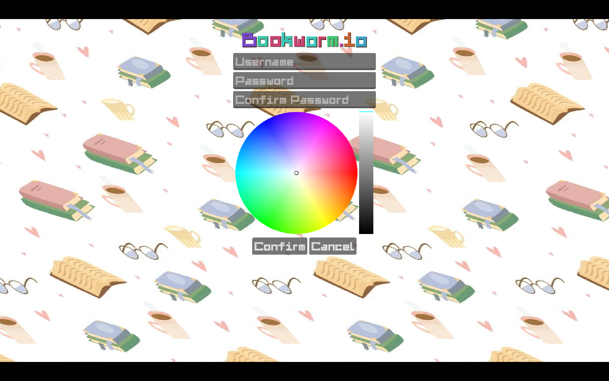

# Bookworm.io

A slither.io style multiplayer online game with Godot client and Go server.
Features

    User registration and login, with your own color
    Passwords hashed with bcrypt, never stored plain
    Highscores browsing and player lookup by name
    In-game multiplayer with bookworms and spores
    In-game chat
    Slither rules, a head into a body is a death and head to head kills both
    Mass drops on death and a respawn with spawn protection
    Minimap with the worms around you
    Camera that zooms out the bigger you get
    Client side interpolation so the movement is smooth
    SQLite for users, colors and best scores
    WebSocket communication
    Protobuf for packet serialization
    TLS with a /health endpoint for keeping the server awake
    Dockerized, with a compose file next to it

Setup
Client (Godot)

    Install Godot 4.7
    Open client/project.godot
    Run the project

Server (Go)

    Install Go 1.27+
    cd server
    go mod tidy
    go run cmd/main.go

The client is pointing at a deployed server, wss://bookworm-927r.onrender.com/ws, so change
SERVER_URL in client/states/entered/entered.gd if you run your own one.

Environment

The server reads server/.env on start, or whatever you pass with --config.

    PORT=8080
    DATA_PATH=          # where db.sqlite is kept, falls back to the mounted docker dir
    CERT_PATH=          # path to the tls certificate, no tls when missing
    KEY_PATH=           # path to the tls key

Docker

    Build: docker build -t bookworm .
    Run: docker run -p 8080:8080 --env-file .env -v $(pwd)/certs:/gameserver/certs bookworm
    Or: docker compose up

The image is a distroless static build pinned to port 10000, which is what Render wants,
and the data dir is a volume so the sqlite file survives a redeploy.

Deployment

    Push the branch and let Render build server/Dockerfile
    Mount the certificate at /gameserver/certs/live and point CERT_PATH and KEY_PATH there
    Put your data dir on a disk, DATA_PATH is where the sqlite file goes
    Hit /health now and then, the free tier sleeps

Project Structure

    client/: Godot game client
        addons/: Custom addons (godobuf, wakatime)
        classes/: UI components (login, register, highscores, logs, minimap)
        exports/: Exported web build
        objects/: Game objects (actors, spores)
        resources/: Assets and themes
        states/: Game states (browsing, connected, entered, ingame)
    server/: Go server
        cmd/: Main entry point
        internal/: Internal packages
            clients/: WebSocket client handling
            objects/: Game objects and spawning
            server/: Server logic, DB, states
                db/: Sqlite queries, generated with sqlc
        pkg/: Shared packages (packets)
    shared/: Shared protobuf definitions

Controls

    Move the mouse to steer the worm
    Scroll to zoom, the camera pulls back as you grow
    Type in the box and hit enter to chat
    Logout drops you back to the login form

Just a copy of this repo and add the necessary .envs and you're good to go.
Here are some screenshot of the game:

    
